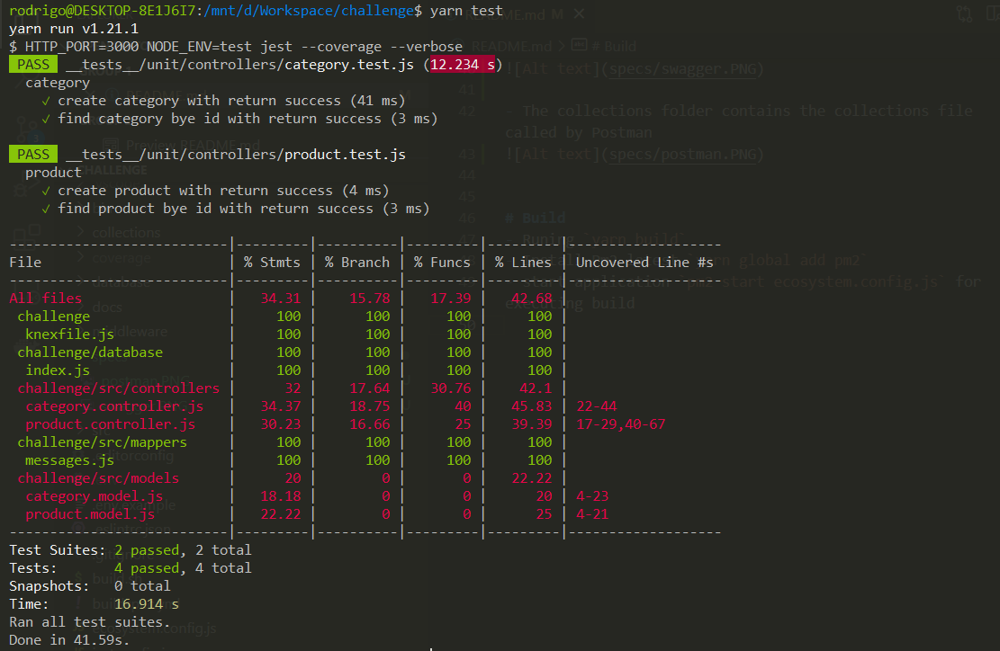
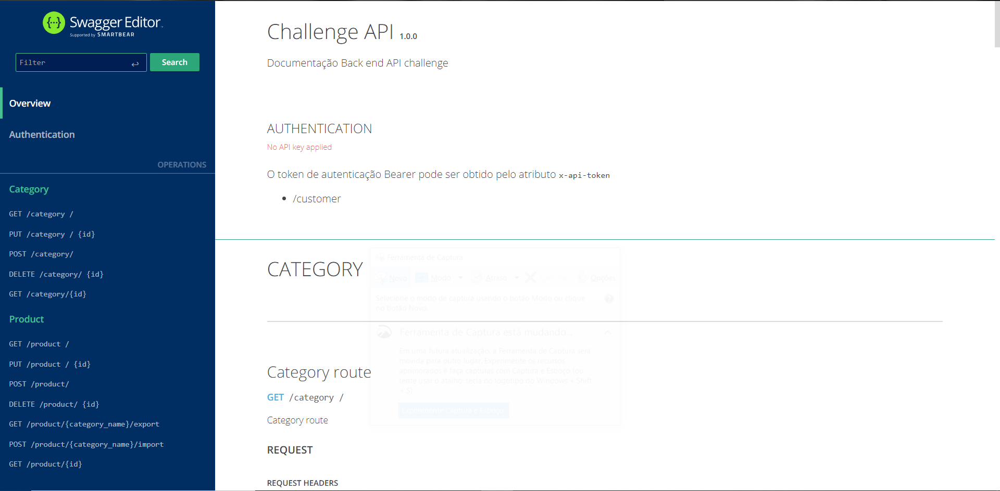
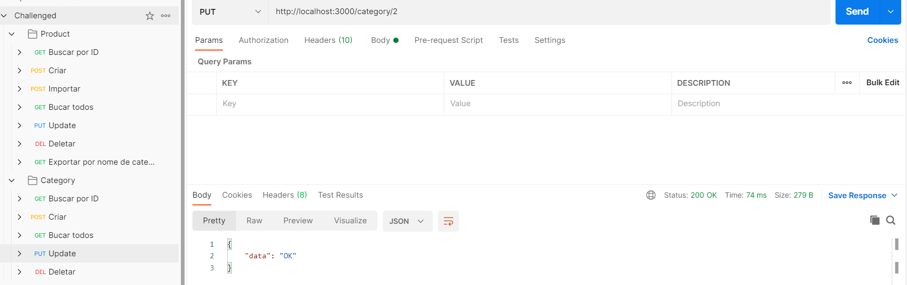

# Challenge
Node Api Basic with postgresSql

# Setup
- Install node > 14.0.0
- Install postgres
- Install npm and yarn
- Instalar as dependências -> `yarn or npm install`
- Rename `.env.example` for `.env`
- Configure variables of enviroment

```
    DEBUG=true
    DEV=true
    DB_USER=postgres
    DB_PASS=root
    DB_HOST=localhost
    DB_PORT=5432
    DB_NAME=Challenge
```

- After configuring the bank's credentials, run the commands below to create the table migrations.
```
npx knex migrate:up or knex migrate:up
```

- If successful migrations run, use the command below to create the test data, seeds.
```
npx knex seed:run or knex seed:run
```

# Test
- Runing unitests `yarn test`


# Start
- Runing api `yarn start:dev`
- Test server in http://localhost:3000/

# Documentation
- Listening documentaion in http://localhost:3000/api-docs


- The collections folder contains the collections file called by Postman



# Build
- Runing `yarn build`
- Install Pm2 latest `yarn global add pm2`
- start application `pm2 start ecosystem.config.js` for executing build
